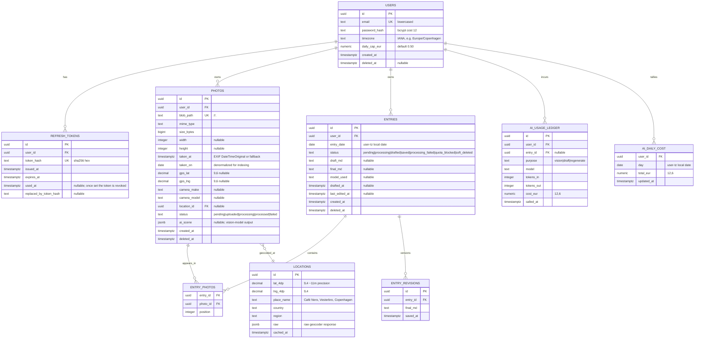

# PixDiary — ERD

## Notes

- Composite PK on `ENTRY_PHOTOS (entry_id, photo_id)` and on `AI_DAILY_COST (user_id, day)`.
- `ENTRIES UNIQUE (user_id, entry_date) WHERE deleted_at IS NULL` — prevents two active entries per day.
- `PHOTOS UNIQUE (user_id, blob_path)` — defensive (blob path is already unique by construction).
- `LOCATIONS UNIQUE (lat_4dp, lng_4dp)` — geocode cache keyed at ~11m precision.
- `ON DELETE`:
  - `users` cascade → refresh_tokens, photos, entries, ai_*, entry_revisions (only on **hard delete**, which is initiated by the account-deletion job).
  - `entries` cascade → entry_photos, entry_revisions.
  - `photos` restrict — orphans must not happen because we delete the entry first.
